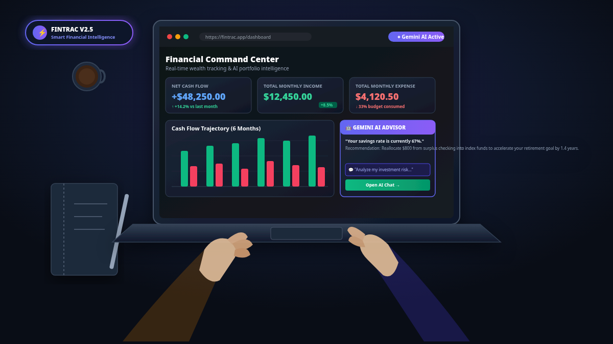
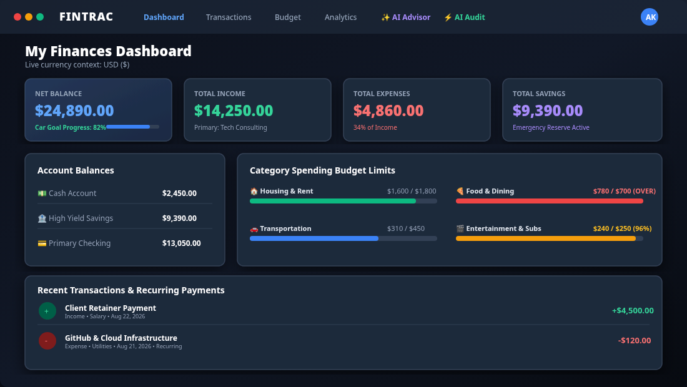
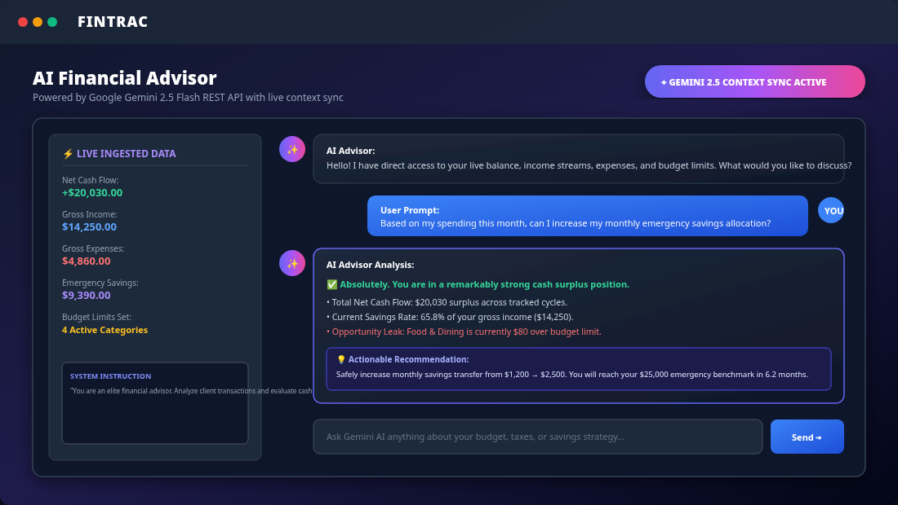
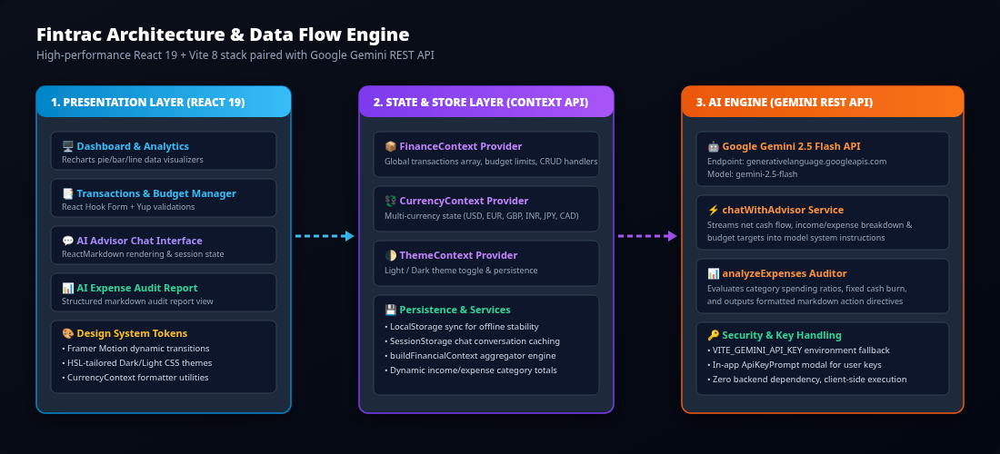
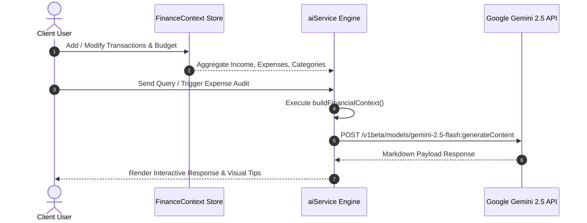

<div align="center">

# 💎 FINTRAC

### Next-Generation AI-Powered Personal Financial Intelligence & Budgeting Platform

[](https://react.dev/)
[](https://vitejs.dev/)
[](https://ai.google.dev/)
[](LICENSE)
[](https://github.com/Aditya2514/Fintrac)

<p align="center">
  <a href="#-key-features">Key Features</a> •
  <a href="#-visual-ui-showcase">UI Showcase</a> •
  <a href="#-system-architecture">Architecture</a> •
  <a href="#-getting-started">Getting Started</a> •
  <a href="#-ai-engine-integration">AI Engine</a> •
  <a href="#-project-structure">Project Structure</a>
</p>

---

<!-- Human Workstation Mockup Banner -->
<p align="center">
  
</p>

</div>

<br />

## 🌟 Overview

**Fintrac** is a high-performance, glassmorphic financial management web application built with **React 19**, **Vite 8**, **Recharts**, and integrated with **Google Gemini 2.5 Flash**. Designed to transcend basic expense trackers, Fintrac turns static transaction numbers into dynamic financial intelligence. 

By ingesting real-time cash flow, multi-account balances, and category budget limits, Fintrac's contextual **AI Financial Advisor** and **Automated Expense Auditor** deliver personalized budget recommendations, cash-burn diagnostics, and mathematically anchored 30-day savings directives.

---

## 📸 Visual UI Showcase

<div align="center">

### 🖥️ 1. Financial Command Center & Dashboard
*Real-time cash flow tracking, account breakdown (Cash, Savings, Online), financial goal progress meters, and spending budget limits.*

<br />

<p align="center">
  
</p>

<br /><br />

### 🤖 2. Context-Aware AI Advisor (Google Gemini 2.5 Flash)
*Interactive chat assistant reading live net balance, income categories, and category expenditure to give personalized wealth advice.*

<br />

<p align="center">
  
</p>

</div>

---

## ⚡ Key Features

### 📊 Real-Time Financial Dashboard
- **Live Net Cash Flow Tracking**: Instant aggregate balance calculation across cash, high-yield savings, and digital checking accounts.
- **Financial Goal Progress Meters**: Visual goal tracking for major milestones (e.g., Car Savings Goal, Student Loan Repayment).
- **Interactive Quick-Add**: Modal transaction launcher for frictionless income and expense logging on the fly.
- **Recent Activity Stream**: Categorized activity timeline with recurring expense tags and real-time category styling.

### 🤖 Context-Aware AI Financial Advisor
- **Powered by Google Gemini 2.5 Flash**: Streams live user financial metrics (net balance, gross income, expense distribution, budget limits) directly into system instructions.
- **Conversational Real-Time Chat**: Ask complex financial questions (*"With my current savings rate, can I afford a house deposit in 2 years?"*) and receive precise, data-backed responses.
- **Session Chat Persistence**: Maintains conversation history with smooth auto-scrolling and custom API key modal configuration.

### ⚡ Automated Expense Audit Engine
- **One-Click Comprehensive Audits**: Evaluates all category expenditure and recurring cash burn in seconds.
- **Emoji-Tagged Category Diagnostics**: Generates 2-3 sentence brutal category spending evaluations paired with 30-day actionable optimization tips.
- **Mathematically Anchored Directives**: Pinpoints systematic cash leaks and provides immediate directives to optimize savings rates.

### 🎯 Smart Budget Planning & Limits
- **Category Limit Configuration**: Set monthly cap limits across Housing, Food & Dining, Transportation, Entertainment, Utilities, Shopping, and Healthcare.
- **Visual Threshold Alerts**: Dynamic progress bars categorized by safety status:
  - 🟢 **Safe**: `< 75%` limit consumed
  - 🟡 **Warning**: `75% - 90%` limit consumed
  - 🔴 **Over-Budget**: `> 90%` limit consumed

### 📈 Interactive Data Analytics
- **Recharts Visualizations**: Donut pie charts for category breakdowns, monthly income vs expense bar charts, and cash flow trend lines.
- **Custom Tooltip Engine**: Hover tooltips dynamically formatted with active currency settings.

### 💱 Multi-Currency & Theme Customization
- **Currency Context API**: Toggle seamlessly between USD (`$`), EUR (`€`), GBP (`£`), INR (`₹`), JPY (`¥`), and CAD (`$`).
- **Glassmorphic UI Design**: Dark & Light mode toggles backed by CSS HSL design tokens, Framer Motion animations, and responsive layout grids.

---

## 🏗️ System Architecture

Fintrac is designed with a modular, client-side architecture that eliminates backend server costs while maintaining bank-grade user privacy. All data is persisted locally via `LocalStorage`, and AI capabilities execute directly via Google's Gemini REST API.

<br />

<div align="center">
  
</div>

<br />

### Tech Stack Specifications

| Layer | Technology | Purpose |
| :--- | :--- | :--- |
| **Frontend Framework** | `React v19.2.4` | Modern UI components, hooks, concurrent rendering |
| **Build Tool & HMR** | `Vite v8.0.1` | Ultra-fast bundling, module resolution, dev server |
| **Routing** | `React Router v7.13.2` | Single Page Application (SPA) client-side navigation |
| **AI Intelligence Engine** | `Google Gemini REST API` | Contextual LLM chat & structured markdown audits |
| **State Management** | `React Context API` | `FinanceContext`, `CurrencyContext`, `ThemeContext` |
| **Data Visualization** | `Recharts v3.8.1` | Interactive SVG bar charts, pie charts, trend lines |
| **Animations & Icons** | `Framer Motion v12` + `React Icons` | Micro-interactions, slide animations, icon sets |
| **Forms & Validation** | `React Hook Form` + `Yup` | Schema validation for transaction creation |
| **Notifications** | `React Toastify v11.0.5` | Real-time feedback alerts & error handling |

---

## 🚀 Getting Started

Follow these steps to set up and run Fintrac locally on your machine.

### Prerequisites

Ensure you have the following installed:
- **Node.js**: `v18.0.0` or higher
- **npm**: `v9.0.0` or higher (or `pnpm`/`yarn`)
- **Google Gemini API Key**: Free key from [Google AI Studio](https://aistudio.google.com/)

### 1. Clone the Repository

```bash
git clone https://github.com/Aditya2514/Fintrac.git
cd Fintrac
```

### 2. Install Dependencies

```bash
npm install
```

### 3. Configure Environment Variables

Create a `.env` file in the root directory of the project:

```env
VITE_GEMINI_API_KEY=your_gemini_api_key_here
```

*(Note: If no `.env` file is provided, you can also enter your Gemini API key directly inside the in-app prompt modal).*

### 4. Start the Development Server

```bash
npm run dev
```

Open your browser and navigate to `http://localhost:5173`.

### 5. Build for Production

```bash
npm run build
```

Preview the production build locally:

```bash
npm run preview
```

---

## 🤖 AI Engine Integration

Fintrac utilizes a dedicated service module [`aiService.js`](file:///home/kskroyal/Projects/fi/Fintrac/src/services/aiService.js) to prepare and sanitize financial context before dispatching requests to Google Gemini 2.5.



### Context Aggregation Function (`buildFinancialContext`)

Before calling Gemini, Fintrac constructs a structured snapshot of the user's financial profile:

```js
const ctx = buildFinancialContext(transactions, budget);
// Returns:
// - netBalance, totalIncome, totalExpenses, totalSavings
// - incomeCats & expenseCats breakdown
// - recurringTotal subscriptions
// - formatted category vs budget summaries
```

---

## 📁 Project Structure

```
Fintrac/
├── public/
│   ├── assets/
│   │   ├── human-workspace-mockup.svg  # Overhead human workspace illustration
│   │   ├── dashboard-view.svg          # Dashboard UI preview frame
│   │   ├── ai-advisor-view.svg         # AI Advisor chat screen preview
│   │   └── system-architecture.svg     # Architecture & data flow diagram
│   ├── favicon.svg
│   └── icons.svg
├── src/
│   ├── assets/                         # Raw static assets
│   ├── components/                     # Reusable UI Components
│   │   ├── ApiKeyPrompt.jsx            # Gemini API Key input modal
│   │   ├── ErrorBoundary.jsx           # Fallback error boundary wrapper
│   │   ├── Layout.jsx                  # Main app shell & sidebar layout
│   │   ├── Navbar.jsx                  # Top navigation bar & theme controls
│   │   ├── QuickAdd.jsx                # Instant transaction drawer modal
│   │   └── Sidebar.jsx                 # Dynamic route navigation sidebar
│   ├── context/                        # React Context Providers
│   │   ├── CurrencyContext.jsx         # Currency selection & formatters
│   │   ├── FinanceContext.jsx          # Transaction state & budget engine
│   │   └── ThemeContext.jsx            # Dark/Light mode CSS theme toggle
│   ├── hooks/                          # Custom React Hooks
│   │   ├── useCurrency.js
│   │   ├── useFinance.js
│   │   └── useTheme.js
│   ├── pages/                          # Application Route Views
│   │   ├── AIAdvisor.jsx               # Interactive Gemini AI Chat page
│   │   ├── AIAnalyzer.jsx              # One-click automated audit engine
│   │   ├── AddTransaction.jsx          # Transaction form page (Create/Edit)
│   │   ├── Analytics.jsx               # Recharts charts & cashflow trends
│   │   ├── Budget.jsx                  # Category budget limits manager
│   │   ├── Dashboard.jsx               # Main finance command center
│   │   ├── Landing.jsx                 # Hero landing page
│   │   └── Transactions.jsx            # Filterable transaction table
│   ├── services/
│   │   └── aiService.js                # Gemini 2.5 Flash REST API service
│   ├── utils/
│   │   └── formatters.js               # Multi-currency formatting helpers
│   ├── App.jsx                         # Main Router & Provider setup
│   ├── index.css                       # Global design tokens & CSS variables
│   └── main.jsx                        # React root entrypoint
├── index.html
├── package.json
├── vite.config.js
└── README.md
```

---

## 🤝 Contributing

Contributions are welcome! If you'd like to improve Fintrac:

1. **Fork the Repository**
2. **Create a Feature Branch** (`git checkout -b feature/AmazingFeature`)
3. **Commit your Changes** (`git commit -m 'Add some AmazingFeature'`)
4. **Push to the Branch** (`git push origin feature/AmazingFeature`)
5. **Open a Pull Request**

---

## 📄 License

Distributed under the **MIT License**. See [`LICENSE`](LICENSE) for more information.

<br />

<div align="center">

**Built with ❤️ using React 19, Vite, & Google Gemini AI**

[⭐ Star this repository](https://github.com/Aditya2514/Fintrac) • [🐛 Report a Bug](https://github.com/Aditya2514/Fintrac/issues) • [💡 Request Feature](https://github.com/Aditya2514/Fintrac/issues)

</div>
